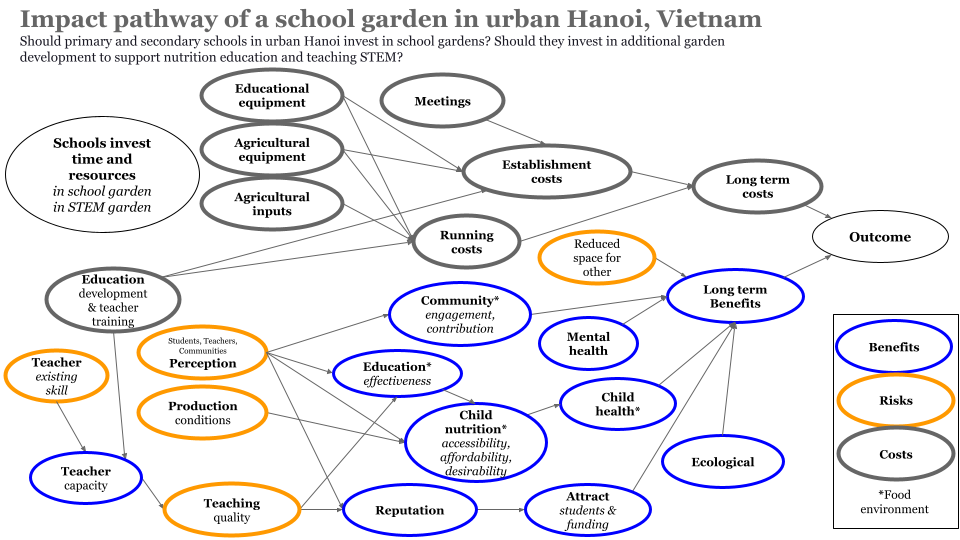

```{r setup, include=FALSE}
library(knitr)
knitr::opts_chunk$set(echo = TRUE)

library(gtExtras)
library(svglite)
library(decisionSupport)
library(plotly)
library(rPref)
library(tidyverse)

set.seed(42)
```

We model a decision impact pathway is for school gardens as a general intervention for sustainable children's food environments in urban Hanoi, Vietnam (Whitney et al. 2024). 



**Conceptual model of school gardens as an intervention. Should urban Hanoi school boards invest time and money in creating school gardens? Should they invest in formal STEM education as part of these gardens?**

# Urban Hanoi school garden 

Simulation of the school garden intervention options:

```{r mcsimulation, warning=FALSE, message=FALSE}
# Source our model
source("CODAS_Garden_Model.R")

# Ensure consistent results with the random number generator
# not for each 'run' of the MC simulation but for 
# consistency each time we run the entire simulation 
set.seed(1234) 

garden_simulation_results <- mcSimulation(
  estimate = estimate_read_csv("data/inputs_school_garden.csv"),
  model_function = school_garden_function,
  numberOfModelRuns = 1e4, #run 10,000 times
  functionSyntax = "plainNames"
)

```

The Net Present Value (i.e. current value of the future benefits) of the garden decision options over `r garden_simulation_results$x$number_of_years[1]` years of the intervention. For public and private schools the STEM costs are considered to be in the same garden space but with the additional costs and benefits of a full STEM education program. All options are compared to the same years of using the land for something that is not related to the garden, i.e. as a playground or for parking. Here we plot the distribution for the decision and frame the projected NPV. 

```{r plot_dist, warning=FALSE, message=FALSE}
source("functions/plot_distributions.R")
plot_distributions(mcSimulation_object = garden_simulation_results, 
                                    vars = c("NPV_garden","NPV_garden_STEM", 
                                             "NPV_garden_public_school", 
                                             "NPV_garden_STEM_public_school"),
                                    method = 'smooth_simple_overlay', 
                                    base_size = 7, 
                                    x_axis_name = "Comparative NPV outcomes")
```

The same results as boxplots: 

```{r plot_boxplot, warning=FALSE, message=FALSE}
source("functions/plot_distributions.R")
plot_distributions(mcSimulation_object = garden_simulation_results, 
                                    vars = c("NPV_garden","NPV_garden_STEM", "NPV_garden_public_school", "NPV_garden_STEM_public_school"),
                                    method = "boxplot", 
                                    base_size = 7, 
                                    x_axis_name = "Comparative NPV outcomes")
```

## Summary of results for the decision

### Summary of the savings for the passive education garden option

```{r summary_decision, warning=FALSE, message=FALSE}
summary(garden_simulation_results$y$NPV_garden)
```

Summary of the savings for the formal STEM education garden option

```{r summary_NPV_garden_STEM, warning=FALSE, message=FALSE}
summary(garden_simulation_results$y$NPV_garden_STEM)
```

## Summary of costs

Total expected costs for a school garden

```{r summary_costs, warning=FALSE, message=FALSE}
summary(garden_simulation_results$y$total_costs)
```

Total expected costs for a school garden with STEM education

```{r summary_costs_stem, warning=FALSE}
summary(garden_simulation_results$y$total_costs_STEM)
```

# First year

First year expected costs for a school garden

```{r summary_first_year_costs, warning=FALSE, message=FALSE}
summary(garden_simulation_results$y$Cashflow_garden1)
```

First year expected costs for a school garden with STEM education

```{r summary_first_year_costs_stem, warning=FALSE, message=FALSE}
summary(garden_simulation_results$y$Cashflow_garden_STEM1)
```

# Expected Value of Perfect Information (EVPI)

Here we assess value of information with the `multi_EVPI` function.

```{r mc_table, warning=FALSE, message=FALSE}
# Subset the outputs from the mcSimulation function (y) by selecting the correct variables be sure to run the multi_EVPI only on the variables that we want. Find them with names(garden_simulation_results$y)
mcSimulation_table <- data.frame(garden_simulation_results$x, 
                                 garden_simulation_results$y[1:9])
```

**Value of information for the garden option (no STEM)**

```{r evpi-general_calc}
source("functions/multi_EVPI.R")

# first_out_var is the first result variable in the table, "NPV_garden" in our case.
# names(garden_simulation_results$y)
#  evpi <- multi_EVPI(mc = mcSimulation_table, first_out_var = "NPV_garden")

# save as a local .csv (takes ~ a day to run this)
# save(evpi,file="data/data_evpi.Rda")
 load("data/data_evpi.Rda")
# open from saved file (last model run)

```


```{r plot-evpi-NPV_garden}
#Value of information the garden intervention decision
  source("functions/plot_evpi.R")
plot_evpi_garden <- plot_evpi(evpi, decision_vars = "NPV_garden")

# In this case there were no high value variables. We can be confident in supporting the decision, even with our imperfect current understanding. 

# Value of information for the garden option with formal STEM education.
# using the results of the same multi_EVPI
plot_evpi_STEM <- plot_evpi(evpi, decision_vars = "NPV_garden_STEM")

# Value of information for the public school garden option with no formal STEM education.

# using the results of the same multi_EVPI
plot_evpi_public <- plot_evpi(evpi, decision_vars = "NPV_garden_public_school")

# Value of information for the public school garden option with formal STEM education.
# using the results of the same multi_EVPI
plot_evpi_public_STEM <- plot_evpi(evpi, decision_vars = "NPV_garden_STEM_public_school")

# Cashflow of the garden option without formal STEM education
# This will be the cost for public and private schools over the intervention. 

source("functions/plot_cashflow.R")
plot_cashflow_garden <- plot_cashflow(mcSimulation_object = garden_simulation_results, 
              cashflow_var_name = "Cashflow_garden") 


# Cashflow of the garden option with formal STEM education
source("functions/plot_cashflow.R")
plot_cashflow_STEM <- plot_cashflow(mcSimulation_object = garden_simulation_results, 
              cashflow_var_name = "Cashflow_garden_STEM")

# Projection to Latent Structures (PLS)
# We use Projection to Latent Structures (PLS) model to get some sense of the correlation strength and direction for model variables and our outcome variables.

# For passive education garden option
source("functions/pls_model.R")
pls_result <- pls_model(object = garden_simulation_results,
                resultName = names(garden_simulation_results$y)[1], # the "NPV_garden" 
                                ncomp = 1)
# read in the common input table
input_table <- read.csv("data/inputs_school_garden.csv")

# source the plot function
source("functions/plot_pls.R")
plot_pls_garden <- plot_pls(pls_result, 
                            input_table = input_table, threshold = 0.9)


#For school garden with formal STEM education
pls_result_STEM <- pls_model(object = garden_simulation_results,
                  resultName = names(garden_simulation_results$y)[2], # the "NPV_garden_STEM" 
                                ncomp = 1)

plot_pls_STEM <- plot_pls(pls_result_STEM, input_table = input_table, threshold = 0.9)

```


```{r full_figure_public_school}

#plot NPV as boxplot, pls, and evpi, evpi share names with pls
#each to a row
#shared x axis (values) and y axis (names)

dist_plot_NPV_garden_public <- plot_distributions(
  mcSimulation_object = garden_simulation_results, 
                                    vars = "NPV_garden_public_school",
                                    method = "boxplot", 
                                    base_size = 7)

dist_plot_NPV_garden_STEM_public <- plot_distributions(
  mcSimulation_object = garden_simulation_results, 
                                    vars = "NPV_garden_STEM_public_school",
                                    method = "boxplot", 
                                    base_size = 7)


# install.packages("devtools")
# devtools::install_github("thomasp85/patchwork")                                    
library(patchwork)

dist_plot_NPV_garden_public | dist_plot_NPV_garden_STEM_public /
plot_pls_garden | plot_pls_STEM /
plot_evpi_STEM | plot_evpi_garden 
```

## Private schools

```{r full_figure_private_school}

#plot NPV as boxplot, pls, and evpi, evpi share names with pls
#each to a row
#shared x axis (values) and y axis (names)

dist_plot_NPV_garden <- plot_distributions(
  mcSimulation_object = garden_simulation_results, 
                                    vars = "NPV_garden",
                                    method = "boxplot", 
                                    base_size = 7)

dist_plot_NPV_garden_STEM <- plot_distributions(
  mcSimulation_object = garden_simulation_results, 
                                    vars = "NPV_garden_STEM",
                                    method = "boxplot", 
                                    base_size = 7)

# "NPV_garden_public_school", "NPV_garden_STEM_public_school"),

# install.packages("devtools")
# devtools::install_github("thomasp85/patchwork")                                    
library(patchwork)

(dist_plot_NPV_garden+ inset_element(plot_cashflow_garden, 0.6, 0.6, 1, 1) | plot_pls_garden | plot_evpi_garden) /
(dist_plot_NPV_garden_STEM+ inset_element(plot_cashflow_STEM, 0.6, 0.6, 1, 1) | plot_pls_STEM | plot_evpi_STEM) 

```

Cashflow for public and private schools

```{r cashflow_garden}
plot_cashflow_garden | plot_cashflow_STEM
```

# Paretto front

These figures display the Pareto-optimal solutions, representing the best trade-offs among the objectives of biodiversity, child health, and economic return. By focusing on these Pareto-optimal points, the analysis highlights solutions where improvements in one objective cannot be achieved without some compromise in at least one other. This approach aids decision-makers in visualizing and evaluating only the most efficient options, helping to balance biodiversity conservation, community health, and economic benefits effectively in the decision-making process.

## Private schools paretto front

```{r pareto_front_private}
source("functions/plot_pareto.R")
private_paretto <- paretto_front(
  economic_return_garden = garden_simulation_results$y$NPV_garden,
  child_health_garden = garden_simulation_results$y$health,
  biodiversity_garden = garden_simulation_results$y$biodiversity,
  economic_return_STEM = garden_simulation_results$y$NPV_garden_STEM,
  child_health_STEM = garden_simulation_results$y$health_STEM,
  biodiversity_STEM = garden_simulation_results$y$biodiversity
)

ggplotly(private_paretto) 

```

## Public schools paretto front

```{r pareto_front_public}
source("functions/plot_pareto.R")
public_paretto <- paretto_front(
  economic_return_garden = garden_simulation_results$y$NPV_garden_public_school,
  child_health_garden = garden_simulation_results$y$health,
  biodiversity_garden = garden_simulation_results$y$biodiversity,
  economic_return_STEM = garden_simulation_results$y$NPV_garden_STEM_public_school,
  child_health_STEM = garden_simulation_results$y$health_STEM,
  biodiversity_STEM = garden_simulation_results$y$biodiversity
)


ggplotly(public_paretto) 
# library(htmlwidgets)
# plot <- ggplotly(public_paretto) 
# saveWidget(plot, "my_plot.html", selfcontained = TRUE)

```

# Input data for the simulations 

## Summary

Here we provide a summary of the garden intervention options. We do this with a summary table of the simulation results. We show the percentage of missing values as well as the mean, median and standard deviation (SD) for each output of our model simulations. We use the `gt_plt_summary()` from {gtExtras} and with options from {svglite}. The table shows the  name, the plot overview as well as the number of missing values, the mean, median and the standard deviation of the distribution for all variables that were fed into the model from our input table of uncertainty values. 

```{r gtExtras_summary_x, warning=FALSE, message=FALSE}
# Subset the outputs from the mcSimulation function (y) to summarize only on the variables that we want.
# names(garden_simulation_results$x)
mcSimulation_table_x <- data.frame(garden_simulation_results$x[4:7,21:30]) #,
 # names(garden_simulation_results$y)

 gtExtras::gt_plt_summary(mcSimulation_table_x) 
# a summary table with missing, mean, median and sd

```

<!-- The table shows the variable name, the plot overview as well as the number of missing values, the mean, median and the standard deviation of the distribution for all variables that were calculated in the model.  -->

<!-- mcSimulation_table_y <- data.frame(garden_simulation_results$y[1:11]) -->
<!-- gtExtras::gt_plt_summary(mcSimulation_table_y) -->

The full repository can be accessed at https://github.com/CWWhitney/urban_school_gardens 

<!-- The git create a qr -->
<!-- library(qrcode) -->
<!-- qrcode_gen('https://github.com/CWWhitney/urban_school_gardens') -->
