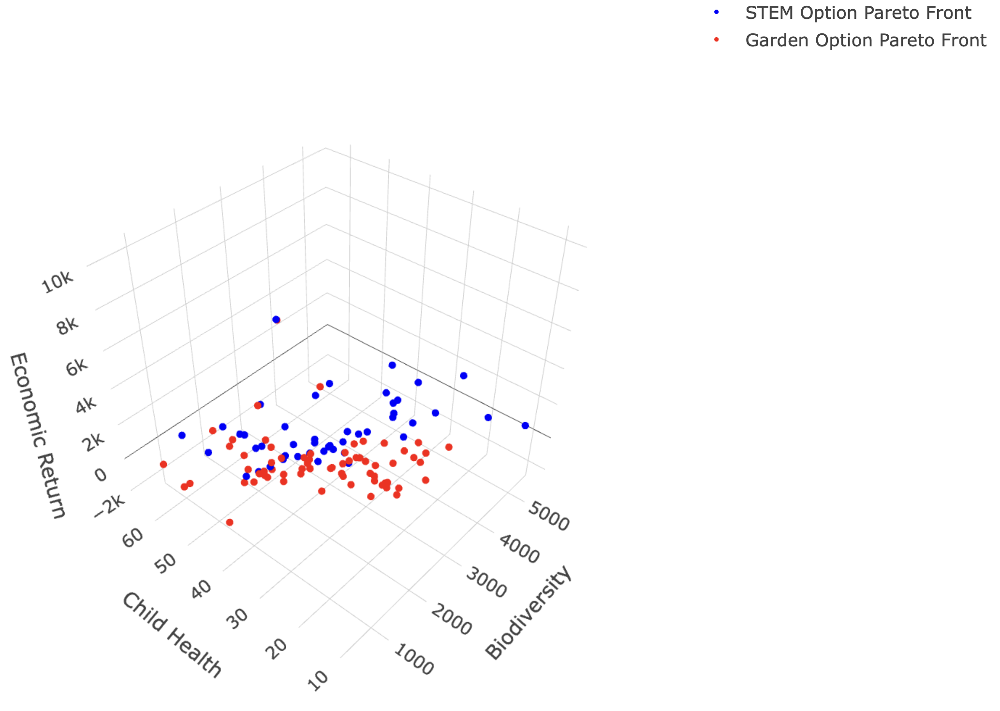
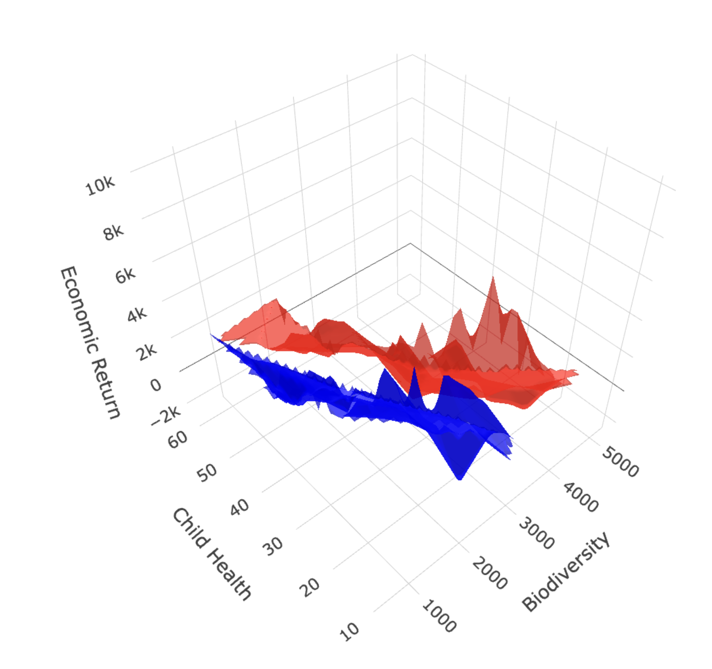
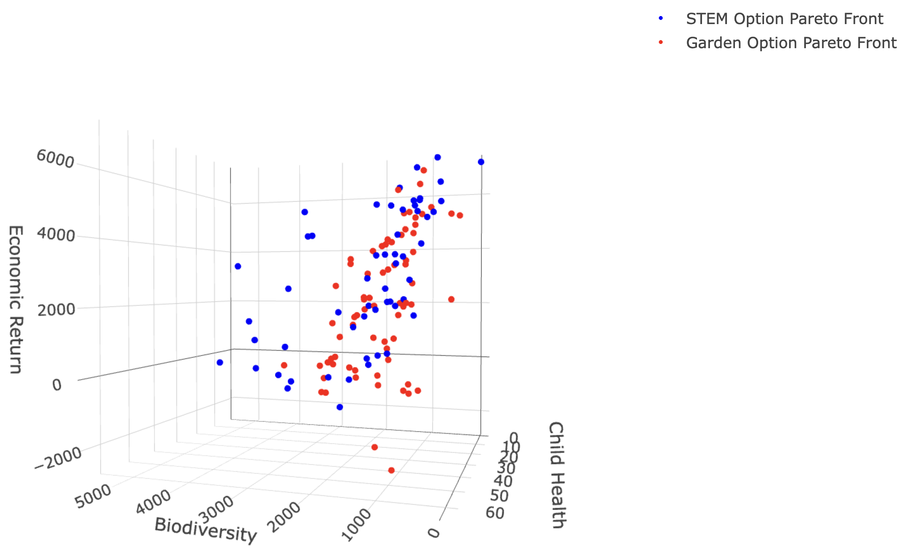
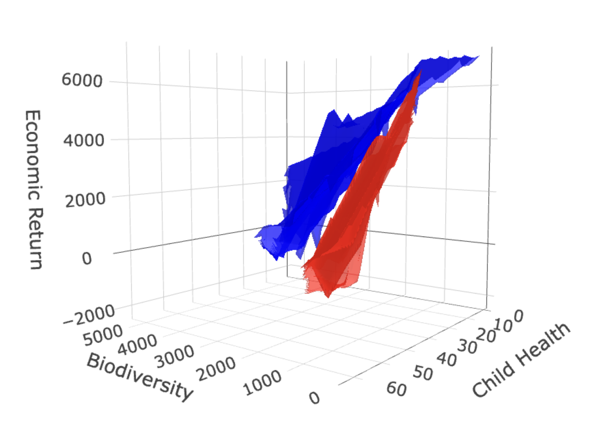

```{r setup, include=FALSE}
library(knitr)
knitr::opts_chunk$set(echo = TRUE,
               out.width = "75%", 
               fig.align = "center")

library(akima)
library(decisionSupport)
library(ggstance)
library(gtExtras)
library(plotly)
library(rPref)
library(svglite)
library(tidyverse)

```

We model a decision impact pathway is for school gardens as a general intervention for sustainable children's food environments in urban Hanoi, Vietnam (Whitney et al. 2024). 


**Conceptual model of school gardens as an intervention. Should urban Hanoi school boards invest time and money in creating school gardens? Should they invest in formal STEM education as part of these gardens?**

# Urban Hanoi school garden 

Simulation of the school garden intervention options:

```{r mcsimulation, warning=FALSE, message=FALSE}
# Source our model
source("CODAS_Garden_Model.R")

# Ensure consistent results with the random number generator
# not for each 'run' of the MC simulation but for 
# consistency each time we run the entire simulation 
set.seed(42)

garden_simulation_results <- mcSimulation(
  estimate = estimate_read_csv("data/inputs_school_garden.csv"),
  model_function = school_garden_function,
  numberOfModelRuns = 1e4, #run 10,000 times
  functionSyntax = "plainNames"
)

```

The Net Present Value (i.e. current value of the future benefits) of the garden decision options over `r garden_simulation_results$x$number_of_years[1]` years of the intervention. For public and private schools the STEM costs are considered to be in the same garden space but with the additional costs and benefits of a full STEM education program. All options are compared to the same years of using the land for something that is not related to the garden, i.e. as a playground or for parking. Here we plot the distribution for the decision and frame the projected NPV. 

For public schools

```{r plot_dist_public, warning=FALSE, message=FALSE}
source("functions/plot_distributions.R")
plot_distributions(mcSimulation_object = garden_simulation_results, 
                                    vars = c("NPV_garden_public_school", 
                                             "NPV_garden_STEM_public_school"),
                                    method = 'smooth_simple_overlay', 
                                    base_size = 7, 
                                    x_axis_name = "Comparative NPV outcomes")
```

For private schools 

```{r plot_dist_private, warning=FALSE, message=FALSE}
source("functions/plot_distributions.R")
plot_distributions(mcSimulation_object = garden_simulation_results, 
                                    vars = c("NPV_garden","NPV_garden_STEM"),
                                    method = 'smooth_simple_overlay', 
                                    base_size = 7, 
                                    x_axis_name = "Comparative NPV outcomes")
```

The same results as boxplots

For public schools

```{r plot_boxplot_public, warning=FALSE, message=FALSE}
source("functions/plot_distributions.R")
plot_distributions(mcSimulation_object = garden_simulation_results, 
                                    vars = c("NPV_garden_public_school", "NPV_garden_STEM_public_school"),
                   old_names = c("NPV_garden_public_school", "NPV_garden_STEM_public_school"),
                   new_names = c("NPV public school garden", "NPV public school garden with STEM"),
                                    method = "boxplot_density", 
                                    base_size = 7, 
                                    x_axis_name = "Comparative NPV outcomes")
```

For private schools

```{r plot_boxplot_private, warning=FALSE, message=FALSE}
source("functions/plot_distributions.R")
plot_distributions(mcSimulation_object = garden_simulation_results, 
                                    vars = c("NPV_garden","NPV_garden_STEM"),
                   old_names = c("NPV_garden","NPV_garden_STEM"),
                   new_names = c("NPV private school garden","NPV private school with STEM"),
                                    method = "boxplot_density", 
                                    base_size = 7, 
                                    x_axis_name = "Comparative NPV outcomes")
```

## Summary of results for the decision

### Summary of the savings for the passive education garden option

```{r summary_decision, warning=FALSE, message=FALSE}
summary(garden_simulation_results$y$NPV_garden)
```

Summary of the savings for the formal STEM education garden option

```{r summary_NPV_garden_STEM, warning=FALSE, message=FALSE}
summary(garden_simulation_results$y$NPV_garden_STEM)
```

## Summary of costs

Total expected costs for a school garden

```{r summary_costs, warning=FALSE, message=FALSE}
summary(garden_simulation_results$y$total_costs)
```

Total expected costs for a school garden with STEM education

```{r summary_costs_stem, warning=FALSE}
summary(garden_simulation_results$y$total_costs_STEM)
```

# First year

First year expected costs for a school garden

```{r summary_first_year_costs, warning=FALSE, message=FALSE}
summary(garden_simulation_results$y$Cashflow_garden1)
```

First year expected costs for a school garden with STEM education

```{r summary_first_year_costs_stem, warning=FALSE, message=FALSE}
summary(garden_simulation_results$y$Cashflow_garden_STEM1)
```

# Expected Value of Perfect Information (EVPI)

Here we assess value of information with the `multi_EVPI` function.

```{r mc_table, warning=FALSE, message=FALSE}
# Subset the outputs from the mcSimulation function (y) by selecting the correct variables be sure to run the multi_EVPI only on the variables that we want. Find them with names(garden_simulation_results$y)
mcSimulation_table <- data.frame(garden_simulation_results$x, 
                                 garden_simulation_results$y[1:9])
```

**Value of information for the garden option (no STEM)**

```{r evpi-general_calc}
source("functions/multi_EVPI.R")

# first_out_var is the first result variable in the table, "NPV_garden" in our case.
# names(garden_simulation_results$y)
#  evpi <- multi_EVPI(mc = mcSimulation_table, first_out_var = "NPV_garden")

# save as a local .csv (takes ~ a day to run this)
# save(evpi,file="data/data_evpi.Rda")
 load("data/data_evpi.Rda")
# open from saved file (last model run)

```

Generate the plots for EVPI PLS and cashflows for public and private schools

```{r plot-evpi-NPV_garden}
#Value of information the garden intervention decision
  source("functions/plot_evpi.R")
plot_evpi_garden <- plot_evpi(evpi, decision_vars = "NPV_garden")

# Value of information for the garden option with formal STEM education.
# using the results of the same multi_EVPI
plot_evpi_STEM <- plot_evpi(evpi, decision_vars = "NPV_garden_STEM")

# Value of information for the public school garden option with no formal STEM education.

# using the results of the same multi_EVPI
plot_evpi_public <- plot_evpi(evpi, decision_vars = "NPV_garden_public_school")

# Value of information for the public school garden option with formal STEM education.
# using the results of the same multi_EVPI
plot_evpi_public_STEM <- plot_evpi(evpi, decision_vars = "NPV_garden_STEM_public_school")

# Cashflow of the garden option without formal STEM education
# This will be the cost for public and private schools over the intervention. 

source("functions/plot_cashflow.R")
plot_cashflow_garden <- plot_cashflow(mcSimulation_object = garden_simulation_results, 
              cashflow_var_name = "Cashflow_garden") 


# Cashflow of the garden option with formal STEM education
source("functions/plot_cashflow.R")
plot_cashflow_STEM <- plot_cashflow(mcSimulation_object = garden_simulation_results, 
              cashflow_var_name = "Cashflow_garden_STEM")

# Projection to Latent Structures (PLS)
# We use Projection to Latent Structures (PLS) model to get some sense of the correlation strength and direction for model variables and our outcome variables.

# For passive education garden option
source("functions/pls_model.R")
pls_result <- pls_model(object = garden_simulation_results,
                resultName = names(garden_simulation_results$y)[1], # the "NPV_garden" 
                                ncomp = 1)
# read in the common input table
input_table <- read.csv("data/inputs_school_garden.csv")

# source the plot function
source("functions/plot_pls.R")
plot_pls_garden <- plot_pls(pls_result, 
                            input_table = input_table, threshold = 0.9)

#For school garden with formal STEM education
pls_result_STEM <- pls_model(object = garden_simulation_results,
                  resultName = names(garden_simulation_results$y)[2], # the "NPV_garden_STEM" 
                                ncomp = 1)

plot_pls_STEM <- plot_pls(pls_result_STEM, input_table = input_table, threshold = 0.9)

```

NPV for public schools 

```{r full_figure_public_school}

#plot NPV as boxplot, pls, and evpi, evpi share names with pls
#each to a row
#shared x axis (values) and y axis (names)

dist_plot_NPV_garden_public <- plot_distributions(
  mcSimulation_object = garden_simulation_results, 
                                    vars = "NPV_garden_public_school",
         old_names = c("NPV_garden_public_school"),
                   new_names = c("NPV public school garden"),
                                    method = "boxplot_density", 
                                    base_size = 7)

dist_plot_NPV_garden_STEM_public <- plot_distributions(
  mcSimulation_object = garden_simulation_results, 
                                    vars = "NPV_garden_STEM_public_school",
         old_names = c("NPV_garden_STEM_public_school"),
                   new_names = c("NPV public school garden with STEM"),
                                    method = "boxplot_density", 
                                    base_size = 7)


# install.packages("devtools")
# devtools::install_github("thomasp85/patchwork")                                    
library(patchwork)

dist_plot_NPV_garden_public / dist_plot_NPV_garden_STEM_public 
```

PLS for public schools 

```{r pls_public}
plot_pls_garden / plot_pls_STEM 
```

EVPI for publis schools 

```{r evpi_public}
plot_evpi_STEM / plot_evpi_garden 
```

## Private schools

NPV for private schools 

```{r full_figure_private_school}

#plot NPV as boxplot, pls, and evpi, evpi share names with pls
#each to a row
#shared x axis (values) and y axis (names)

dist_plot_NPV_garden <- plot_distributions(
  mcSimulation_object = garden_simulation_results, 
                                    vars = "NPV_garden",
         old_names = c("NPV_garden"),
                   new_names = c("NPV private school garden"),
                                    method = "boxplot_density", 
                                    base_size = 7)

dist_plot_NPV_garden_STEM <- plot_distributions(
  mcSimulation_object = garden_simulation_results, 
                                    vars = "NPV_garden_STEM",
         old_names = c("NPV_garden_STEM"),
                   new_names = c("NPV private school with STEM"),
                                    method = "boxplot_density", 
                                    base_size = 7)

# "NPV_garden_public_school", "NPV_garden_STEM_public_school"),

# install.packages("devtools")
# devtools::install_github("thomasp85/patchwork")                                    
library(patchwork)

dist_plot_NPV_garden /
dist_plot_NPV_garden_STEM

```

PLS for private schools 

```{r pls_private}
plot_pls_garden / plot_evpi_garden 
```

EVPI for private schools 

```{r evpi_private}
 plot_pls_STEM / plot_evpi_STEM
```

## Cash flows

Cash flow plots of the garden option without formal STEM education. These are the expected costs for public and private schools over the intervention.

```{r cashflow_garden}
plot_cashflow_garden / plot_cashflow_STEM
```

# Pareto front

These figures display the Pareto-optimal solutions, representing the best trade-offs among the objectives of biodiversity, child health, and economic return. By focusing on these Pareto-optimal points, the analysis highlights solutions where improvements in one objective cannot be achieved without some compromise in at least one other. 

## Private schools pareto front

```{r pareto_front_private}
source("functions/plot_pareto.R")
private_pareto <- pareto_front(
  economic_return_garden = garden_simulation_results$y$NPV_garden,
  child_health_garden = garden_simulation_results$y$health,
  biodiversity_garden = garden_simulation_results$y$biodiversity,
  economic_return_STEM = garden_simulation_results$y$NPV_garden_STEM,
  child_health_STEM = garden_simulation_results$y$health_STEM,
  biodiversity_STEM = garden_simulation_results$y$biodiversity, 
  plot_return = "scatter" 
)

ggplotly(private_pareto) 

```

<!--   -->

```{r image_grobs_pareto_private, fig.show = "hold", out.width = "50%", fig.align = "default"}


```

Trade offs for private school pareto 

```{r pareto_front_posthoc_private}

source("functions/pareto_front_posthoc.R")
private_pareto_posthoc <- pareto_front_posthoc(
  economic_return_garden = garden_simulation_results$y$NPV_garden,
  child_health_garden = garden_simulation_results$y$health,
  biodiversity_garden = garden_simulation_results$y$biodiversity,
  economic_return_STEM = garden_simulation_results$y$NPV_garden_STEM,
  child_health_STEM = garden_simulation_results$y$health_STEM,
  biodiversity_STEM = garden_simulation_results$y$biodiversity 
)
private_pareto_posthoc

```

**From 10,000 Monte Carlo simulations, we determined the Pareto-optimal points for the STEM and Garden options for private schools.**

For private schools, the Garden option has more Pareto-optimal points (66) than the STEM option (47). This suggests that the Garden option offers a wider range of trade-offs, meaning there are more diverse configurations where it efficiently balances economic return, biodiversity, and child health. In contrast, the STEM option has fewer Pareto-optimal points, indicating more specific or constrained trade-offs among the objectives.

**STEM Option in Private Schools**

Economic Return: The economic return for the STEM option ranges from -576.6 to 10,218.6 (Median: 2178.2, Mean: 2883.6), with potential negative returns (losses) and high positive returns up to 10,218.6. The median and mean are close, indicating a relatively balanced distribution with both high and low values.

Biodiversity: Biodiversity outcomes range from 718.5 to 5452.9 (Median: 1867.4, Mean: 2212.3). A high maximum biodiversity score suggests that the STEM option may achieve strong biodiversity outcomes in some configurations, though the median indicates that most solutions lie in a more moderate range.

Child Health: Child health outcomes range from 7.671 to 64.952 (Median: 31.754, Mean: 31.578). With the median close to the mean, the child health distribution is symmetric, indicating balanced outcomes across configurations.

**Garden Option in Private Schools**

Economic Return: The Garden option shows a wide economic return range, from -2564.8 to 10,175.3 (Median: 2264.2, Mean: 2536.1). Like the STEM option, it has potential for high returns but also includes configurations with substantial losses. The proximity of the mean and median suggests a symmetric distribution of returns.

Biodiversity: Biodiversity values in the Garden option range from 402.6 to 3775.8 (Median: 1533.7, Mean: 1623.1). The Garden option achieves generally lower maximum biodiversity than the STEM option, although the median value indicates consistent, moderate biodiversity levels across configurations.

Child Health: Child health scores range from 7.671 to 64.952, with a median of 26.716 and a mean of 28.389. Similar to the STEM option, the distribution is fairly symmetric, suggesting balanced child health outcomes.

**Key Insights**

Higher Maximum Economic Returns in STEM: The STEM option reaches a slightly higher maximum economic return (10,218.6 vs. 10,175.3), though both options show potential for significant positive returns. Both options also include configurations with negative returns, highlighting the importance of careful selection to avoid losses.

Biodiversity Potential: The STEM option achieves a higher maximum biodiversity score (5452.9 vs. 3775.8), suggesting that, in its best configurations, it may be better suited for maximizing biodiversity outcomes compared to the Garden option.

Symmetry in Child Health Outcomes: Both options exhibit similar distributions in child health, with symmetric outcomes centered around moderate values, indicating relatively balanced trade-offs in this objective.

**Overall Conclusion**

In private schools, both STEM and Garden options offer configurations that can achieve high economic returns and biodiversity, though the STEM option may provide higher maximum biodiversity and economic outcomes. The Garden option’s performance, with more moderate values, may represent more stable trade-offs among the objectives. This comparison highlights the need to prioritize objectives based on specific goals within private school settings.

## Public schools pareto front

```{r pareto_front_public}
source("functions/plot_pareto.R")
public_pareto <- pareto_front(
  economic_return_garden = garden_simulation_results$y$NPV_garden_public_school,
  child_health_garden = garden_simulation_results$y$health,
  biodiversity_garden = garden_simulation_results$y$biodiversity,
  economic_return_STEM = garden_simulation_results$y$NPV_garden_STEM_public_school,
  child_health_STEM = garden_simulation_results$y$health_STEM,
  biodiversity_STEM = garden_simulation_results$y$biodiversity, 
   plot_return = "scatter" 
)

ggplotly(public_pareto) 

```

<!-- copy and store locally for hosted page -->
 <!--   -->

```{r image_grobs_pareto_public, fig.show = "hold", out.width = "50%", fig.align = "default"}


```

Pareto-optimal points for public school options

```{r pareto_front_posthoc_public}

source("functions/pareto_front_posthoc.R")
public_pareto_posthoc <- pareto_front_posthoc(
  economic_return_garden = garden_simulation_results$y$NPV_garden_public_school,
  child_health_garden = garden_simulation_results$y$health,
  biodiversity_garden = garden_simulation_results$y$biodiversity,
  economic_return_STEM = garden_simulation_results$y$NPV_garden_STEM_public_school,
  child_health_STEM = garden_simulation_results$y$health_STEM,
  biodiversity_STEM = garden_simulation_results$y$biodiversity
)
public_pareto_posthoc

```

**From 10,000 Monte Carlo simulations, we determined the Pareto-optimal points for the STEM and Garden options in public schools.**

For public schools, the Garden option also has more Pareto-optimal points (71) than the STEM option (56). This also suggests that the Garden option offers a wider range of trade-offs, meaning there are more diverse configurations where it efficiently balances economic return, biodiversity, and child health. 

**STEM Option in Public Schools**

Economic Return: The economic return values for the STEM option vary significantly, ranging from -576.6 to 7138.2 (Median: 2839.3, Mean: 2978.7). The distribution includes both negative returns (indicating potential losses) and a high positive return of 7138.2. The proximity of the median and mean suggests a balanced distribution with both high and low values.

Biodiversity: Biodiversity outcomes for the STEM option also show a wide range, from 0 to 5453 (Median: 1469, Mean: 1823). The median value indicates that half of the Pareto-optimal points fall below 1469, while the high maximum value highlights configurations with very high biodiversity outcomes.

Child Health: Child health scores for STEM range from 0 to 64.95 (Median: 27.83, Mean: 28.17). With the median close to the mean, the distribution appears symmetric around these central values, suggesting balanced trade-offs in child health outcomes.
Garden Option in Public Schools

**Garden Option in Public Schools**

Economic Return: Economic return for the Garden option varies widely as well, with values ranging from large negative returns (losses) to a maximum of 6583.17 (Median: 2078.6, Mean: 2151.91). The proximity of the mean and median indicates a symmetric distribution with both high and low values.

Biodiversity: Biodiversity outcomes in the Garden option range from a minimum of 151.4 to a maximum of 3775.8, with a median of 1404.3. While the Garden option includes configurations with relatively high biodiversity outcomes, it generally achieves lower maximum biodiversity than the STEM option.

Child Health: Child health scores for the Garden option range from 7.671 to 64.952, with a median of 24.732. Like the STEM option, the child health distribution is roughly symmetric around the mean, and the values are similar between both options.

**Key Insights**

Wider Range of Pareto-Optimal Solutions in the Garden Option: The greater number of Pareto-optimal points in the Garden option indicates more flexibility and a broader range of configurations that efficiently balance economic return, biodiversity, and child health.

Higher Maximum Biodiversity in STEM: The STEM option reaches a much higher maximum biodiversity score (5453 vs. 3775.8), suggesting that it may achieve greater biodiversity outcomes in its best configurations.

Variability in Economic Returns: Both options exhibit considerable variability in economic returns, including both positive and negative values. The STEM option has a slightly higher maximum economic return (7138.2), which could be relevant if economic outcomes are prioritized.

For public schools the Garden option offers more flexibility in balancing economic return, biodiversity, and child health, suggesting it may be more adaptable to varied priorities within public school contexts. This range of solutions allows decision-makers to select from a broader set of efficient trade-offs that align with different objectives. In contrast, the STEM option presents fewer, more specific trade-offs, but it stands out with its potential for higher maximum outcomes in both economic return and biodiversity. This makes the STEM option particularly suitable for scenarios where high biodiversity or economic outcomes are prioritized, even if the range of balanced configurations is somewhat narrower. 

# Input data for the simulations 

## Summary

Here we provide a summary of the garden intervention options. We do this with a summary table of the simulation results. We show the percentage of missing values as well as the mean, median and standard deviation (SD) for each output of our model simulations. We use the `gt_plt_summary()` from {gtExtras} and with options from {svglite}. The table shows the  name, the plot overview as well as the number of missing values, the mean, median and the standard deviation of the distribution for all variables that were fed into the model from our input table of uncertainty values. 

```{r gtExtras_summary_x, warning=FALSE, message=FALSE}
# Subset the outputs from the mcSimulation function (y) to summarize only on the variables that we want.
# names(garden_simulation_results$x)
mcSimulation_table_x <- data.frame(garden_simulation_results$x[4:7,21:30]) #, ,32:41,43:70,73:76 also of possible interest

 gtExtras::gt_plt_summary(mcSimulation_table_x) 
# a summary table with missing, mean, median and sd

```

The table shows the variable name, the plot overview as well as the number of missing values, the mean, median and the standard deviation of the distribution for variables that calculated in the model.

<!-- mcSimulation_table_y <- data.frame(garden_simulation_results$y[1:11]) -->
<!-- gtExtras::gt_plt_summary(mcSimulation_table_y) -->

The full repository can be accessed at https://github.com/CWWhitney/urban_school_gardens

<!-- The git create a qr -->
<!-- library(qrcode) -->
<!-- qrcode_gen('https://github.com/CWWhitney/urban_school_gardens') -->
